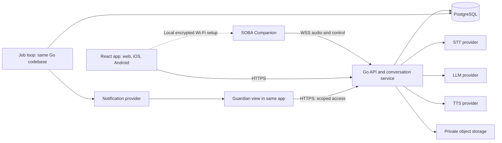
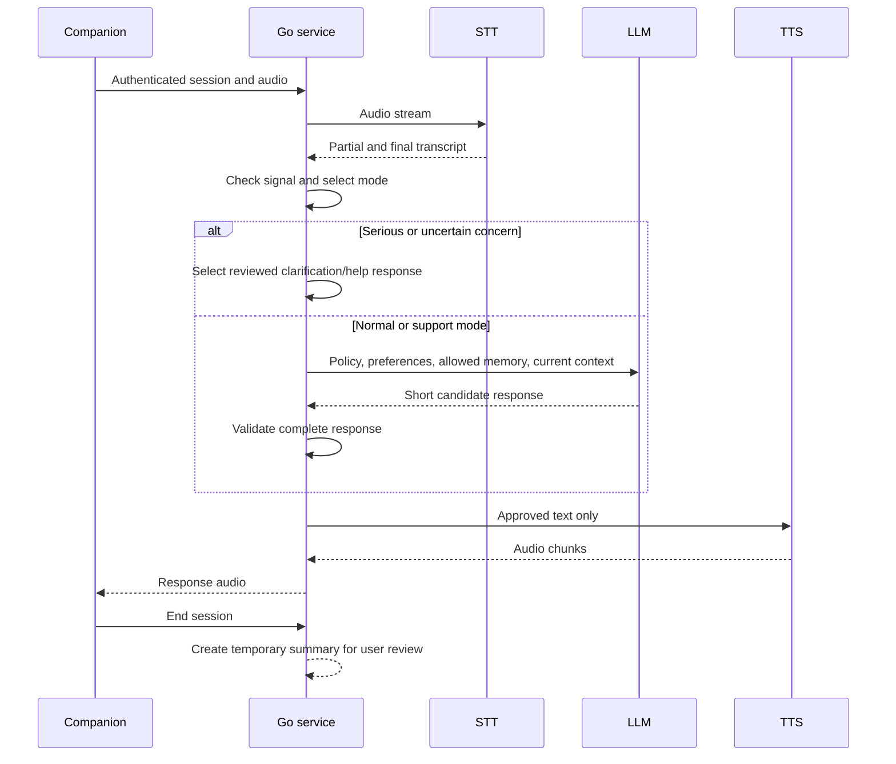

# SOBA — Technical design

Version 1.0 • 7 September 2026 • Design proposal for team review

## 1. Purpose and evidence

Build SOBA as a voice companion that helps young people express feelings, receive everyday support, and connect to people when needed. The core journey is **LISTEN → SUPPORT → CONNECT**. The product includes a portable physical companion and an application with user and guardian views.

This design covers every feature table and each flow stage on the supplied [SOBA Notion page](https://app.notion.com/p/raineryesaya/SOBA-3d40560e43d880efbf68caca2589736d). The [source notes](Notion-Source-Notes.md) contain the complete structured reading, all 22 feature requirements, the six flow stages, source gaps, and the [original flow image](assets/notion-flow.webp).

Evidence labels:

- **Requirement:** directly stated in Notion. IDs C1–C7, U1–U9, G1–G6, and F1–F6 map to the source notes.
- **Existing direction:** verified in the local repository on 7 September 2026.
- **Proposal:** a technical choice made in this design. It is not a decision already approved by the team.
- **Open decision:** Notion and the repository do not give enough information to make a final choice.

Unless marked otherwise, implementation details below are proposals. No software was implemented, no provider was configured, and no message was sent as part of this design.

### Existing direction and changes needed

The local repository at `/home/xavrir/Soba` contains documentation and repository checks. The inspected module directories have no application manifests yet. Existing direction is Go, PostgreSQL, `pgx`, plain SQL migrations, and React + Vite + TypeScript + Tailwind. Hardware, LLM, and TTS choices remain open. AssemblyAI is the documented STT choice.

| Existing document statement | Notion evidence | Design resolution |
| --- | --- | --- |
| Web companion app | F1 explicitly includes iOS and Android | Keep React/Vite and add a native container for mobile |
| README says everything gets saved | F4 includes separate save choices and no-save | Do not save conversation content by default |
| Batch STT first is recommended | C1 requires real-time voice | Batch can be an internal prototype; it does not pass the real-time release requirement |
| Pairing and authentication are open | F1 requires QR/code pairing | Define secure device claiming and local Wi-Fi setup separately |
| Guardian data rights are broad in the old safety document | G2 excludes private conversations and journals | Guardian relationship alone must not grant private-content access |
| AssemblyAI selected | Indonesian examples and context in Notion | Resolve the streaming language gap before an Indonesian release |

These are proposed corrections to the older documents. This task did not edit the repository. Age-specific consent and access rules need review before a minor-user release; neither the old wording nor this design is a legal determination.

## 2. System architecture

Use a **modular monolith**: one Go application with clear internal packages, one PostgreSQL database, and one shared frontend. Run a small background job loop from the same codebase. Use private object storage only for approved static audio, temporary exports, and firmware packages. Do not add a message broker or vector database for the first release.

All provider credentials stay on the backend. The device receives only its own SOBA credential. The app never gets an STT, LLM, TTS, or notification service key.

| Component | Responsibility |
| --- | --- |
| `frontend/` | One React app, role-specific routes, data controls, mobile container projects |
| `backend/internal/auth` | User identity, app sessions, device credentials, relationship authorization |
| `backend/internal/devices` | Claiming, ownership, status, settings, revocation |
| `backend/internal/conversation` | Session state, turn order, context, response generation |
| `backend/internal/speech` | STT and TTS adapters, audio validation, stream lifecycle |
| `backend/internal/safety` | Signal assessment, response policy, controlled support path |
| `backend/internal/wellbeing` | Check-ins, summaries, selected memory, toolkit content |
| `backend/internal/support` | Trusted contacts, guardian links, support requests, referrals |
| `backend/internal/jobs` | Notification delivery, deletion, exports, expiry |
| `backend/internal/store` | Owner-scoped SQL and migrations |
| `iot/` | Capture, playback, Wi-Fi setup, mute, status, firmware update |

Start with ordinary functions and concrete structs. Use small interfaces only at external provider boundaries and where tests need a substitute.

### App delivery

**Proposal:** add Capacitor to the existing React/Vite direction. It supports a web codebase inside iOS and Android applications. This avoids a second UI implementation. The team still needs native builds, device tests, and store delivery work. [Capacitor documentation](https://capacitorjs.com/docs)

Use native bridges for QR scanning, secure token storage, notifications, and device provisioning. Do not assume that Bluetooth provisioning works from every mobile browser. Build the initial setup flow in the mobile application. The web version can manage already paired devices.

The first voice client is the physical companion. A browser audio client is also required for development. Direct voice chat in the released app is a proposed extension, not an explicit Notion feature.

## 3. Requirements mapped to the design

| ID | Feature | Implementation and acceptance condition |
| --- | --- | --- |
| C1 | Real Time Voice Conversation | WSS session and streaming STT/TTS; measure complete speech response delay (§6, §12) |
| C2 | Emotionally Adaptive Response | Context-based response style with user correction; no diagnostic output (§6) |
| C3 | Personalized Companion | Versioned personality, voice, and listen-first preferences (§5, §6) |
| C4 | Conversation Memory | Separate user-approved memory records; editable and deletable (§8) |
| C5 | Grounding Support | Reviewed, versioned voice activities with pause/stop controls (§7) |
| C6 | Safety Detection | Assessment before generated speech; uncertainty has a controlled path (§7) |
| C7 | Human Connection | Permission-aware support request and verified contact destination (§7, §10) |
| U1 | My Soba | QR/code claiming, Wi-Fi setup, last-seen and battery state (§5) |
| U2 | Mood Dashboard | Voluntary check-ins and approved conversation mood entries (§8) |
| U3 | Journal & Reflection | Save selected summaries; discard unselected content (§8) |
| U4 | Mood & Pattern | Time-based charts with source labels and missing-data states (§8) |
| U5 | Wellbeing Toolkit | Browse and revisit reviewed breathing, grounding, reflection, activity content (§7) |
| U6 | Circle of Trust | Create, verify, permit, revoke, and remove contact relationships (§4, §10) |
| U7 | Professional Support | Verified directory, external access, and referral status (§10) |
| U8 | Soba Personalization | Same settings apply to future device turns (§6) |
| U9 | Memory & Privacy | View, edit, delete, export, and withdraw sharing (§8, §9) |
| G1 | Wellbeing Pulse | Authorized high-level summaries and check-in counts (§4, §8) |
| G2 | Mood Trend | Aggregate data only; never return journal or transcript fields (§4) |
| G3 | Safety Alert | Serious concern plus valid permission produces a tracked notification (§7, §10) |
| G4 | Reach Out | Verified call/message actions; never imply a completed call from a button press (§10) |
| G5 | Parent Coach | Reviewed guidance library; no use of private journal content (§10) |
| G6 | Safety & Connection Status | Scope checks for contacts, plans, and referrals on each read (§4, §10) |

F1 maps to onboarding (§5). F2–F3 map to voice and response modes (§6–§7). F4 maps to selective persistence (§8). F5 maps to app views (§4, §8, §10). F6 maps to human support (§10).

## 4. Identity, roles, and consent

Use an established OpenID Connect identity provider. Keep its subject identifier separate from SOBA profile IDs. The provider is an open deployment choice. Use authorization-code flows with PKCE for mobile; store mobile refresh tokens in platform secure storage. Use secure, HttpOnly session cookies for web, with CSRF checks on changes. Set explicit allowed origins. Do not store long-lived tokens in browser local storage.

Choosing a guardian role at signup does not grant access to anyone. Access requires an active relationship, user approval, and specific sharing permissions. One account may have both roles. Always select the subject profile explicitly in the guardian view.

### Access matrix

| Resource | User | Linked guardian | Trusted person |
| --- | --- | --- | --- |
| Own preferences and devices | Read/change | No default access | None |
| Own saved journal and memory | Read/change/delete | None | None |
| Raw audio or full transcript | No permanent store in v1 | None | None |
| Mood entries | Own records | Aggregate only with grant | None |
| Wellbeing pulse | Own view | With pulse grant | None |
| Safety notification | Own request/status | With alert grant | Only selected permitted recipient |
| Safety plan | Own records | Explicit shared fields | Only explicitly shared content |
| Referral status | Own records | Separate referral grant | None by default |
| Coach resources | Read | Read | Public resources if applicable |

Grant scopes are separate: `wellbeing_pulse`, `mood_trend`, `safety_alerts`, `trusted_contacts`, `safety_plan`, and `referral_status`. Consent to use memory is separate from permission to share with a guardian. Consent to process speech is separate from consent to store derived content.

Each grant records subject, recipient, scope, start time, expiry if any, policy version, and revocation time. Check current permission in SQL for every protected read and before each queued notification send. Never trust a `user_id` or role supplied by the client without authorization.

Invitation states: `pending → accepted → active`, or `expired/revoked`. The user must approve the final relationship. Codes expire, are single-use, and are rate-limited. A copied invite or a contact phone number does not prove identity. Confirm the recipient through the identity provider or a verified channel before activation.

**Open decision:** target ages and consent authority by market. The Notion flow calls guardian linking optional, while the older repository has rules for children. Do not treat optional linking as a complete child-consent policy. Build age/consent policy checks as an explicit onboarding gate. A minor-user release remains blocked until the team approves this policy and the required review is complete.

## 5. Onboarding, device pairing, and hardware

Follow the seven onboarding steps in F1. Let users configure privacy and skip optional trusted-contact linking without blocking ordinary account use. Device status must distinguish `unpaired`, `provisioning`, `online`, `offline`, and `revoked`.

### Two separate operations

**Local Wi-Fi setup** gives the device a network connection. **Cloud claiming** binds the device to a SOBA account. A QR scan alone must not transfer ownership.

1. Each manufactured device has a unique ID and unique bootstrap credential. Store only a verifier on the backend. Provide a separate local proof-of-possession secret with the device.
2. The signed-in app scans a QR or accepts a typed code. The user places the device in pairing mode with a physical control.
3. The app opens an authenticated, encrypted local provisioning session. Send Wi-Fi credentials only to the device; do not route them through the SOBA API or analytics.
4. The backend creates a short-lived claim challenge bound to the user and device. The app passes it through the local setup session.
5. After Wi-Fi connects, the device authenticates with its bootstrap credential and confirms that challenge.
6. A database transaction binds the unclaimed device to the user. A unique constraint prevents two owners. Issue a per-device operational credential; invalidate the bootstrap claim capability.
7. The app displays success only after the backend confirms ownership and an authenticated device heartbeat arrives.

Proposed claim lifetime: five minutes. Expiry requires a new claim. Use rate limits and one-time challenge consumption. A public device serial number must not act as a secret.

For an ESP32-S3 prototype, use Espressif's supported secure provisioning scheme rather than writing a new cryptographic protocol. Security 2 uses SRP6a and AES-GCM. [Espressif provisioning documentation](https://docs.espressif.com/projects/esp-idf/en/v5.0.6/esp32s3/api-reference/provisioning/wifi_provisioning.html)

Store Wi-Fi and operational credentials using the board's protected storage configuration. Require TLS certificate validation. Verify signed firmware before update. Test update interruption and rollback. These are design requirements; hardware security has not been tested in this task.

### Ownership and daily use

Propose one owner profile per device in v1. A device may not fetch arbitrary user history. It receives only the context needed by its active session through the backend. Voice recognition is not authentication. Offer a private session with memory disabled if the owner cannot be confirmed. Require an app authorization or configured device access control for personal-memory playback in a shared space.

Unpairing revokes the operational credential and stops active sessions. Reset erases Wi-Fi, credentials, and buffers. A reset must not let a stolen device take over the previous account. Ownership transfer requires the previous owner's release or a documented recovery process.

Heartbeat proposal: every 30 seconds while active. Show offline after 90 seconds without a heartbeat. Show `last_seen_at` and `battery_reported_at`; do not present stale values as live. Device configuration uses a revision number, with the applied revision returned by the device.

### Hardware proposal and limits

Start evaluation with an ESP32-S3 board with sufficient external RAM, I2S microphone, amplifier/speaker, physical start/stop control, microphone mute, and a visible recording light. Board, component part numbers, battery, charging circuit, and enclosure remain open. Select these after capture, thermal, battery, and acoustic tests in the actual plush enclosure.

Start recording only after a user action. Stop must work locally even if the server is unavailable. For the first prototype, use turn-taking playback and an immediate stop button. Hands-free interruption during playback requires tested echo cancellation; a noisy playback loop is not acceptable.

Portability means home Wi-Fi or a phone hotspot in this proposal. There is no cellular modem requirement. Offline operation provides a clear connection status and cached, reviewed toolkit audio; it cannot provide cloud conversation or send alerts. Never silently queue private room audio for later upload.

## 6. Voice protocol and conversation processing

### Provider choice

The current AssemblyAI streaming language list includes 18 languages but does **not** list Indonesian. Its older FAQ gives a different, smaller list. Use the current model documentation for capability decisions. Batch support must not be treated as streaming support. [Current multilingual documentation](https://www.assemblyai.com/docs/streaming/multilingual-transcription)

**Proposal:** keep the STT adapter independent of conversation logic. Evaluate Deepgram Nova-3 with `language=id` for the Indonesian voice path. Its model table lists Indonesian and describes Nova-3 for batch and streaming. That establishes a candidate, not measured suitability for SOBA. Mixed Indonesian/English speech still needs a separate test. Do not assume its `multi` mode covers Indonesian. [Deepgram model and language table](https://developers.deepgram.com/docs/models-languages-overview)

The team must approve any change from AssemblyAI and review provider data handling. If AssemblyAI is mandatory, obtain verified Indonesian streaming support or explicitly accept a limited prototype. Do not quietly replace real-time conversation with slow batch processing.

LLM and TTS providers remain open. Select them with the same recorded Indonesian evaluation set, response safety tests, cost limits, regional availability, and retention review. Use one configured provider per function initially. Do not silently send data to a backup vendor after failure.

### Transport contract

Use HTTPS for account data and WSS for device audio. The backend authenticates the device before accepting audio and checks its current owner and recording consent. A development browser client uses an authenticated, short-lived session ticket. Do not place reusable secrets in URLs.

Proposed audio input: 16 kHz, signed 16-bit little-endian PCM, mono. Use 20 ms capture frames: 640 bytes of PCM per frame. Coalesce frames as required by the selected STT adapter. The input rate is 32,000 bytes per second, or about 1.92 MB per minute before transport overhead. AssemblyAI's current API supports this PCM format; this does not resolve its language gap. [Streaming API reference](https://www.assemblyai.com/docs/streaming/api-spec/streaming-websocket)

Text frames carry JSON control events. Binary input frames carry a 4-byte unsigned sequence number, followed by PCM bytes. Only one input turn is open per connection. Binary output frames carry a 4-byte response sequence and 4-byte chunk sequence, followed by audio bytes. All integer headers use network byte order. `response.start` declares the response sequence and audio format. Stale response sequences are discarded after cancellation.

| Client → server | Purpose |
| --- | --- |
| `session.start` | Protocol version, audio format, selected device settings revision |
| `input.start` | New client turn ID; wait for `input.ready` before audio |
| Binary audio | Ordered frames for the active turn |
| `input.end` | End the active turn |
| `response.cancel` | Stop the identified response and flush device playback |
| `session.end` | End conversation and offer the save review |

| Server → client | Purpose |
| --- | --- |
| `session.ready` | Server session ID and effective limits |
| `input.ready` | Server turn ID and accepted format |
| `transcript.partial/final` | Development/app display; not a persistence instruction |
| `mode.changed` | `normal`, `support`, or `safety` |
| `response.start/end` | Response ID, sequence, audio format, and final state |
| Binary audio | Approved response audio chunks |
| `session.summary_ready` | Short-lived review handle for the owner app |
| `error` | Stable error code and whether a new turn is allowed |

Every JSON event includes `version`, `session_id` once assigned, `event_id`, and the relevant `turn_id` or `response_id`. Proposed maximums: 16 KB control event, 64 KB binary message, two seconds of unsent capture buffer, 120 seconds per input turn, and 30 minutes per session. Make limits configurable and test them with realistic pauses.

If a sequence gap, invalid format, or buffer overflow occurs, fail the affected turn and ask for a repeat. Do not continue with an incomplete transcript as if it were complete. Use server ping/pong and a finite timeout. Reconnect creates a new session; do not replay old private audio automatically. Deduplicate finalized STT turns by provider session and turn ID, including later formatting updates.

### Turn processing

Use the final transcript for normal reply generation. Partial transcripts may trigger an early pause or a support prompt, but must not cause a notification by themselves. Assemble context from a versioned policy, approved personality, interaction preferences, relevant approved memory, and bounded current-session turns.

Treat transcript and memory text as untrusted data. A spoken instruction cannot change access rules, disclose another profile, or create a trusted contact. Model output cannot directly invoke messaging, change consent, or run database writes.

An emotional label is a tentative description, not a diagnosis. Prefer explicit user statements over inferred labels. Never infer a clinical condition from pitch, crying, or sentiment alone. Accept a correction and allow `unknown`. No custom emotion model or training pipeline is needed in v1.

Keep replies short. Generate the full short reply, validate it, then start TTS. This makes the safety boundary simpler than speaking unchecked tokens. It may increase delay; measure that cost rather than bypass the check. TTS output must be converted to a format the device declares it can play.

Cloud speech connections must close on stop, disconnect, timeout, and cancellation. AssemblyAI documents billing for the time the streaming connection remains open, which makes idle cleanup part of cost control. [Streaming quickstart](https://www.assemblyai.com/docs/streaming/getting-started/transcribe-streaming-audio)

## 7. Response modes and safety behavior

Notion requires three modes. Implement a small policy-driven state machine. Emotional adaptation must never change consent or disclosure rules.

| Mode | Entry | Response | Exit |
| --- | --- | --- | --- |
| Normal | Ordinary conversation, no concerning signal | Listen, reflect, and follow preferences | User asks for activity, signal changes, or session ends |
| Support | User asks for grounding, or accepts an offer | Reviewed activity steps; pause and stop controls | User stops/finishes, or a safety signal appears |
| Safety | Serious signal, or unresolved signal uncertainty | Reviewed clarification and human-help choices | Explicit policy outcome or user ends session |

Use a separate safety assessment result: `none`, `needs_clarification`, `serious`, or `unavailable`. Store a policy version and coarse reason codes only when persistence is permitted. Do not present these values as clinical measurements.

For a serious signal, use a reviewed response set instead of unrestricted generation. For uncertainty, ask a short, reviewed clarification and make help available. For assessment failure, stop normal generated advice and use a controlled fallback. Do not treat classifier failure as permission to notify anyone.

The actual thresholds, scripts, handling of abuse disclosures, and release evaluation need qualified review. This design specifies software behavior, not a clinical triage protocol. Do not notify a person named as unsafe merely because they have a guardian role.

### Permission-aware alert path

1. Record a serious concern in active session state.
2. Explain available human support using the approved policy.
3. Resolve an eligible trusted recipient and the exact data permitted for sharing.
4. Require current user confirmation, or an explicit active standing permission whose conditions match. The initial proposal uses per-event confirmation.
5. Create a minimal support request and notification job in one database transaction.
6. Before sending, check recipient validity and permission again. If permission was revoked, cancel the job.
7. Show separate delivery and human acknowledgement states. An accepted notification is not proof of help.

If no recipient is allowed, offer user-controlled contact actions and approved local resources. No silent guardian notification, automatic location transmission, or automatic emergency dispatch is proposed.

Do not delay a permitted support request until the conversation ends or until a journal is saved. Notification authorization and journal persistence are different decisions.

### Toolkit

Store reviewed activity content as versioned records: title, language, age suitability, steps, optional audio, reviewer, and review date. The model can suggest an activity ID; it cannot invent safety-critical activity instructions. Include grounding, breathing, reflection, and simple activity resources from Notion. The user can decline, stop, or return to conversation at any step.

## 8. Data model, memory, and insights

Use UUID primary keys, UTC timestamps, foreign keys, explicit status checks, and owner-scoped indexes. Store the profile timezone for date grouping. Avoid a generic entity table or unrestricted JSON for permissions.

| Table/group | Main fields and rules |
| --- | --- |
| `users`, `profiles` | Identity subject, display name, locale, timezone, age-policy state; unique identity subject |
| `preferences` | Profile ID, personality ID, voice ID, listen-first flag, revision |
| `devices`, `device_credentials` | Device ID, owner, state, credential verifier, last seen, battery, applied revision; one owner per device |
| `device_claims` | User/device, challenge hash, expiry, consumed time; single-use |
| `guardian_links`, `contact_links` | Subject, recipient/contact, verification and relationship state |
| `consent_grants` | Subject, grantee, scope, policy version, granted/revoked/expiry times |
| `conversation_sessions` | Owner, device, start/end, processing state, protocol version; no transcript column |
| `journal_entries` | Owner, session, approved topic/reflection/key insights, saved time, version |
| `mood_entries` | Owner, optional session, source (`check_in` or `conversation`), user-approved label, time, timezone |
| `memories` | Owner, approved text, source session, category, saved/updated time; no automatic promotion |
| `toolkit_items`, `coach_items` | Reviewed localized content and version metadata |
| `safety_events` | Minimal event state, policy version, authorized support linkage; no raw transcript |
| `support_requests`, `notification_jobs` | Subject, recipient, authorized payload reference, grant version, state, attempts, next attempt |
| `safety_plans`, `referrals` | User-controlled content/status and separate sharing grants |
| `support_resources` | Verified directory details, location/language, access link, review/expiry date |
| `deletion_jobs`, `audit_events` | Deletion progress and non-content access/action metadata |

Composite foreign keys or equivalent store checks must stop a saved entry from referencing another owner's session. Unique `(session_id, save_request_id)` constraints prevent duplicate saves. Index owner/time fields for history and next-attempt/state fields for job polling.

### End-of-session save transaction

F4 requires a draft containing mood, main topic, reflection, key insights, and safety level. Generate that draft in transient session memory. The user-facing view uses a plain support-status description rather than an unexplained risk score.

The owner reviews three independent choices: **journal**, **mood history**, and **memory**. Show memory candidates individually. Each is off until selected. A saved journal does not authorize future LLM memory retrieval. Saving a mood does not save its source conversation.

Propose a ten-minute review window after the session ends. Discard content immediately when the user selects no-save; discard remaining unapproved content when the window expires. If the service restarts, an unsaved draft may be lost. This is preferable to silently making a permanent copy. Tell the user that the review is temporary. Raw audio is discarded as soon as the active processing path no longer needs it.

The save endpoint accepts selected fields, candidate IDs, expected draft version, and an idempotency key. In one transaction, verify owner, current consent, and draft validity; write only selected records. Return success only after commit. Expired drafts return a stable `draft_expired` result, not a partial save.

### Memory retrieval

Start with a small set of approved facts and preferences. Retrieve by owner and simple categories or text matching. Do not add embeddings until retrieval measurements show a need. Cap context size and prioritize recent, relevant facts. Show source and edit/delete controls. Never use one profile's memory for another device owner.

A deleted memory becomes unavailable to new turns immediately. Cancel or rebuild an in-flight response if withdrawn data is already in its context and the response has not been delivered. A provider request already sent cannot be recalled; explain provider retention limits accurately in the data policy.

### Mood and guardian summaries

Keep self-reported and conversation-derived entries distinguishable. Ask the user to confirm inferred mood before persistence. Offer correction. Do not fill missing days with neutral or positive values.

Use one shared aggregation service for Mood Dashboard and Mood & Pattern. Show dates, entry counts, and source labels. No clinical score or automatic diagnosis is proposed. Use approved stored entries only; no-save conversations do not affect trends.

Guardian endpoints return dedicated response types containing permitted counts and broad trends. Do not serialize journal/memory records and remove fields in the frontend. Proposed privacy limit: weekly buckets with trends suppressed when fewer than three entries exist. Show `insufficient_data`. Exact counts require their own pulse scope. Let the team review these thresholds with users; they are not from Notion.

Deleting or changing entries invalidates the affected aggregates. v1 can compute aggregates directly from PostgreSQL to avoid stale materialized views.

## 9. API outline and data lifecycle

All routes use `/v1`. Errors return a stable code and request ID, without sensitive details. Lists use bounded cursor pagination. Changes use idempotency keys where retries can create duplicates; versioned edits reject stale versions with `409`.

| Route | Contract |
| --- | --- |
| `GET/PATCH /me` | Own profile and allowed onboarding fields |
| `GET/PATCH /me/preferences` | Versioned preference settings |
| `POST /device-claims` | Begin claim for authenticated user |
| `POST /device-claims/{id}/confirm` | Device-authenticated proof; atomic ownership binding |
| `GET /devices`, `DELETE /devices/{id}` | Own device status; revoke/unpair |
| `POST /device-heartbeats` | Device credential; bounded telemetry only |
| `POST /voice-tickets`, `GET /voice` | Short-lived app ticket; WSS upgrade for audio protocol |
| `GET /sessions/{id}/draft` | Own temporary summary or explicit expiry |
| `POST /sessions/{id}/save` | Independent journal/mood/memory selections |
| `GET/POST/PATCH/DELETE /mood-entries[/{id}]` | Own voluntary or approved mood data |
| `GET /mood-trends` | Own aggregates for bounded date range |
| `GET/POST/PATCH/DELETE /journals[/{id}]` | Own saved reflection content |
| `GET/POST/PATCH/DELETE /memories[/{id}]` | Own explicitly approved memory |
| `GET /toolkit`, `GET /toolkit/{id}` | Reviewed activity list and versioned content |
| `GET/POST/DELETE /trusted-contacts[/{id}]` | Own verified contact setup and revocation |
| `POST /guardian-invites`, `POST /guardian-invites/{id}/accept` | Expiring recipient acceptance |
| `POST /guardian-links/{id}/approve`, `DELETE /guardian-links/{id}` | Subject approval and immediate revocation |
| `GET/POST/DELETE /consents[/{id}]` | View, grant, and revoke individual scopes |
| `GET /guardian/subjects/{id}/pulse` | Relationship and pulse scope; aggregate DTO only |
| `GET /guardian/subjects/{id}/trends` | Relationship and trend scope; privacy limits |
| `GET /guardian/subjects/{id}/connection-status` | Field-specific grants for contacts/plans/referrals |
| `GET /guardian/alerts`, `POST /guardian/alerts/{id}/acknowledge` | Authorized alerts; acknowledgement is not resolution |
| `GET /parent-coach` | Reviewed guidance content |
| `GET /support-resources` | Verified directory filtered by explicit user region/language |
| `POST/GET /support-requests[/{id}]` | Permission-aware human support action and status |
| `GET/PUT /safety-plan`, `GET/POST/PATCH /referrals[/{id}]` | Own plan and referral status |
| `POST /exports`, `GET /exports/{id}` | Reauthenticated owner export job and expiry |
| `POST /deletions`, `GET /deletions/{id}` | Reauthenticated deletion job and visible progress |

Bracket notation groups list/item operations; implementation must publish exact routes and schemas in OpenAPI. A route group is not permission to expose unrestricted CRUD.

### Retention proposal

| Data | Default lifecycle |
| --- | --- |
| Raw audio | Bounded active buffers only; never routine logs or permanent object storage |
| Full transcript and unapproved draft | Active session plus at most ten-minute review window |
| Unsaved session metadata | At most 24 hours for operational cleanup, without text or mood labels |
| Approved journal/mood/memory | Until user deletion or a chosen expiry; disclose this clearly |
| Support event and delivery metadata | Proposed 30 days; minimize fields and require approved support processing |
| Security/audit metadata | Proposed 90 days; no conversation content |
| Export | Private, owner-only download; delete within 24 hours |
| Backups | Proposed 30-day expiry; deletion replay before any restored data serves traffic |

The team must approve retention durations. Provider storage/training/deletion behavior requires separate verification. Local buffer deletion does not prove vendor deletion. If a provider cannot meet the declared policy, do not use it for that data path.

Encrypt traffic and storage. Restrict production content access. Do not log audio, transcript, journal text, contact destinations, tokens, or full model prompts. Disable sensitive request-body capture in error tools.

Deletion first blocks access and further context use, then removes records, derived data, exports, and vendor-held artifacts where applicable. Track pending vendor deletion explicitly. Retain a minimal deletion ledger until backup expiry, so restoration cannot restore deleted user content. Do not label a deletion complete while required vendor jobs are pending.

## 10. Human support and guardian features

### Trusted contacts and reach-out actions

Allow a user to manage trusted people independently of guardians. Verify destinations and make permission scope visible. Send a minimal template that asks the recipient to open the authenticated app; avoid sensitive detail in a lock-screen notification.

Use a notification adapter behind the Go service. Start with native push plus a separately configured verified channel when approved. If a trusted person has no app, the selected SMS/email provider and payload policy are release decisions. Never assume that adding a contact means any channel may receive any content.

Reach Out opens an OS call or message action to a verified destination. A prepared message remains user-controlled. SOBA does not record calls. Record `action_opened`, not `call_completed`, unless a real integration provides that evidence.

### Delivery state and retries

Support request states: `awaiting_permission`, `queued`, `provider_accepted`, `delivered` when confirmed, `acknowledged`, `failed`, `cancelled`. Track resolution separately from acknowledgement. Never change to resolved merely because a push was tapped.

Write the support request and job row together. The worker claims a job with a short database transaction and a lease; it makes the external call outside the transaction. Retry expired leases after a crash. Use an idempotency key per event/recipient/channel. Without provider-side idempotency, a crash after send can produce a duplicate: make the payload safe for that case and do not claim exactly-once delivery.

Proposed retry times: immediate, 10 seconds, 30 seconds, and two minutes. Stop on permission withdrawal, invalid destination, expiry, or acknowledgement. Retry only transient failures. Authenticate delivery webhooks and deduplicate provider event IDs. Reconcile unknown outcomes when the provider supports status lookup.

If delivery fails or nobody acknowledges, show that status and offer user-controlled alternatives. Any automatic fallback recipient needs a separate explicit policy and grant. A worker must never invent an escalation chain.

### Professional support, plans, and parent coaching

Use a small verified resource directory for v1. Include region, languages, contact/access link, availability information, source, reviewer, and review expiry. Do not invent an available appointment. A resource click means the access page opened; it does not mean a booking exists. Store a referral state only from an actual integration or a clearly labeled user report.

Let users create or select a reviewed safety-plan structure. Keep it private unless specific fields are shared. The guardian connection view displays only currently permitted contacts, plan fields, and referral state.

Parent Coach starts as reviewed guidance content filtered by language and permitted broad context. It must not use private transcripts or journals. A generative parent-coach model is not required for the first release.

Crisis resources must be verified for the launch market before release. Do not ship the historical contact number from the repository without verification. This document intentionally does not select a live helpline or give medical guidance.

## 11. Deployment and failure behavior

Start with a single backend instance, managed PostgreSQL, TLS termination, and the static frontend. Run the job loop in the same deployment initially. Keep development, staging, and production isolated. Use synthetic conversations in development. Store secrets outside source control and publish only empty examples.

The initial deployment keeps active conversation buffers in process memory. A restart ends those sessions and loses unsaved drafts. Use graceful draining during deploys: stop new sessions, let active turns finish within a bounded window, then close cleanly. If future load requires more replicas, keep each active socket on one instance and coordinate device session leases before enabling concurrent ownership-sensitive operations.

| Failure | Required behavior |
| --- | --- |
| Wi-Fi/device connection lost | Stop capture after the bounded buffer; show offline; no hidden replay |
| STT error or unsupported language | State the limitation and offer repeat/toolkit; do not invent a transcript |
| Silence or poor capture | Ask for repeat only as needed; do not infer mood from missing text |
| LLM unavailable or response rejected | Use reviewed fallback; no unchecked generated speech |
| TTS unavailable | App may show approved text; device uses a local availability prompt |
| Safety assessment unavailable | Controlled help/clarification path; no automatic external alert |
| Database unavailable | Block new sessions and writes; end active processing with a clear status; never claim a save or alert succeeded |
| Notification failure | Preserve visible pending/failed status and offer alternatives |
| Grant revoked | Deny new reads, cancel queued sends, clear scoped cached data |
| Service restart | Close session; discard unsaved content; recover durable jobs from leases |
| Firmware update interrupted | Boot a verified working image; do not require a working cloud conversation to recover |

Measure request latency, time to first audible response, dropped frames, active streams, STT/TTS/LLM errors, safety-path availability, job age, delivery failures, and deletion backlog. Use random request IDs and aggregate metrics. Do not put user text or safety labels in general telemetry.

Back up PostgreSQL and test restoration with the deletion ledger. Keep a feature switch to stop new voice sessions while leaving account access and static support resources available. Every dependency needs a finite timeout and cancellation tied to session state.

## 12. Performance, cost, and validation

The following values are engineering test targets, not Notion requirements or measured results.

| Measure | Initial target |
| --- | --- |
| End of user speech to first audible approved response | p50 ≤ 2 seconds; p95 ≤ 4 seconds on the defined test network |
| Physical stop to stopped playback/capture | ≤ 200 ms on device |
| Ordinary app reads | p95 ≤ 500 ms, excluding mobile network transit |
| Device active-state update | Within the 30-second heartbeat interval |
| Consent revocation | Deny new access once the transaction commits; queued sends re-check before dispatch |
| Content deletion in live SOBA stores | Within 24 hours, with immediate access denial |
| Voice concurrency | Validate 10 simultaneous sessions before a small pilot; this is not a forecast |

For an initial p95 latency budget, allocate roughly 600 ms for endpointing/final transcript, 2.4 seconds for input assessment plus short reply generation and validation, 600 ms for first TTS audio, and 400 ms for network/playback. Measure the full chain on the device. The old 1.5-second repository estimate did not establish validated output-check cost; keep it as an aspiration until measured.

Estimate monthly cost from actual provider rates at selection time:

`voice session minutes × STT rate + input/output tokens × LLM rates + generated speech units × TTS rate + notification sends × channel rates + fixed hosting/storage`

Track idle connected minutes, not only speech minutes. Set per-account duration and concurrency limits, close unused streams, and alert on budget use. Define the pilot budget before procurement. No price or provider bill was verified in this task.

### Required tests

| Test area | Evidence needed before release |
| --- | --- |
| Authorization | Guardian and unrelated-user requests cannot read journals, memory, or another profile's data; test APIs directly |
| Consent | Independent save flags, no-save, withdrawal during a turn, queued-alert revocation, and field-specific guardian sharing |
| Pairing | Wrong proof, expired code, concurrent claims, reset, ownership transfer, revoked credential |
| Voice | Indonesian slang, regional accents, code-switching, pauses, quiet speech, background TV, plush enclosure, playback echo |
| Turn ordering | Duplicate finals, stale responses after cancel, reconnect, invalid formats, overflow, partial-turn failure |
| Safety | Reviewed labeled scenario set; missed concerns, excessive alerts, ambiguous statements, unsafe-recipient cases, classifier outage, prompt injection |
| Notifications | Provider failure, duplicate webhook, crash after send, no acknowledgement, no false delivered state |
| Persistence | Transaction rollback, repeated save, expired draft, separate memory approval, deletion and backup restoration |
| Mobile | Real iOS and Android setup, QR/manual entry, secure storage, notification permissions, app background/foreground transitions |
| Hardware | Local mute/stop, listening indicator, battery reports, Wi-Fi loss, thermal/charge behavior, OTA interruption |

Use synthetic or specifically consented evaluation recordings. Clinical/safety reviewers must define acceptable error thresholds and age-appropriate behavior before a young-user pilot. A green unit test suite does not establish safe mental-health performance.

### Build sequence

1. **Resolve release decisions:** ages, launch languages, provider data terms, speech provider gap, notification policy, hardware, and budget. Create contract schemas and reviewed fixture content.
2. **Build the first voice path:** authenticated simulated device → streaming STT → policy → short response → checked TTS. Include cancellation and no-save. Pass latency and failure tests before calling it real-time.
3. **Build user data controls:** profile, preferences, voluntary check-ins, selective saves, journal, memory, charts, deletion, and toolkit. Pass ownership and no-save tests.
4. **Build human support:** verified contacts, guardian invitation/approval, grant checks, aggregate views, alerts with retry states, coach content, directory, plan, and referral state.
5. **Build physical and mobile delivery:** secure local provisioning, device claiming, status, firmware, Capacitor iOS/Android builds, and actual-device tests.
6. **Run the bounded pilot:** complete privacy, safety, recovery, performance, and hardware validation; record measured limits and unresolved issues before a wider release.

Steps can overlap where contracts are stable, but guardian alerts cannot be considered complete before permission and delivery-failure tests pass. No calendar estimates are given because team capacity and deadline are absent from Notion.

## 13. Decisions still needed

| Decision | Proposed default | Required before |
| --- | --- | --- |
| Launch languages | Indonesian first; test English code-switching separately | Speech provider selection |
| STT | Evaluate Nova-3 `id`; retain adapter boundary | Indonesian real-time release |
| LLM/TTS | One approved provider each after evaluation | End-to-end voice integration |
| Target ages and authority | Explicit policy gate; no implied guardian rights | Minor-user onboarding |
| Guardian notification consent | Per-event confirmation initially | External alert release |
| Device ownership | One owner profile per device | Pairing schema |
| Shared-space identity | Private mode without memory unless owner is confirmed | Personal-memory playback |
| Mobile stack | React/Vite with Capacitor | Mobile implementation |
| Board and audio/power parts | ESP32-S3 evaluation, not a purchase decision | Firmware and enclosure build |
| Contact channels | Push plus one approved verified fallback | Human connection release |
| Professional support depth | Directory and tracked user-reported referral, not bookings | U7 acceptance review |
| Data durations and region | Proposed limits in §9; region still open | Provider configuration and production |
| Support scripts/thresholds | Qualified review and versioned content | User pilot |
| Pilot size, budget, availability | Test 10 concurrent sessions; confirm real constraints | Infrastructure sizing |

This design is complete as a technical proposal. These decisions remain explicit so the implementation does not turn assumptions into hidden product rules.

## 14. Source and verification record

- **Primary requirements:** [SOBA Notion page](https://app.notion.com/p/raineryesaya/SOBA-3d40560e43d880efbf68caca2589736d), all accessible expanded sections and both images, read 7 September 2026. See [source coverage and translated requirements](Notion-Source-Notes.md).
- **Existing direction:** local repository README, backend README, and `docs/architecture.md`, `docs/speech-pipeline.md`, `docs/hardware.md`, `docs/safety-and-privacy.md`, and `docs/conventions.md`, read on the same date. Existing Obsidian notes were used for discovery; repository statements were checked live.
- **Technical capability checks:** official AssemblyAI, Deepgram, Capacitor, and Espressif pages linked at the relevant design decisions. Capability documentation is not runtime validation.
- **Validation for this deliverable:** requirement coverage, file links, image presence, and consistency checks. No application tests or provider benchmarks were run because no implementation was created.
