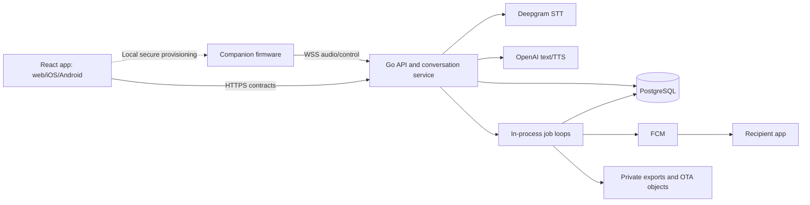

# SOBA — Technical design and implementation specification

**Document ID:** SOBA-TD-002
**Version:** 2.0.0
**Date:** 7 September 2026
**Status:** Complete software specification proposed for implementation; release review required
**Audience:** Frontend, backend, firmware, QA, product, and operations teams

## 1. Document control and how to use this package

This version replaces the earlier architecture-only proposal. It defines buildable software contracts, database constraints, screen behavior, state machines, provider adapters, failure handling, deployment rules, and acceptance tests. The original [v1 architecture proposal](Architecture-Proposal-v1.md) is retained for history.

| Document | Purpose | Authority |
| --- | --- | --- |
| This TD | Scope, baseline decisions, ownership, sequence, and release boundaries | Normative |
| [Notion source notes](Notion-Source-Notes.md) | All accessible source requirements, 22 feature rows, six flow stages, and source limits | Product evidence |
| [OpenAPI contract](implementation/contracts/openapi.yaml) | Exact HTTP paths, authentication, request/response fields, enums, bounds, statuses | Normative wire contract |
| [Database reference](implementation/Database-Spec.md) | Relationships, DTO mapping, query examples, deletion order | Normative |
| [SQL migration](implementation/database/001_initial.sql) | Executable schema, relationships, indexes, checks, version triggers | Normative storage contract |
| [Backend specification](implementation/Backend-Spec.md) | Transactions, authorization, jobs, data lifecycle, identity | Normative behavior |
| [Frontend specification](implementation/Frontend-Spec.md) | Screens, forms, actions, states, native bridges, accessibility | Normative UI behavior |
| [Voice and device specification](implementation/Voice-Device-Spec.md) | Audio framing, state machine, firmware, AI adapters | Normative protocol behavior |
| [Operations specification](implementation/Operations-Spec.md) | Config, deploy, retention, recovery, release roles | Normative operational behavior |
| [Acceptance tests](implementation/Acceptance-Tests.md) | Requirement-level scenarios, failure tests, delivery checklist | Normative acceptance criteria |
| [Validation report](implementation/Validation-Report.md) | Checks actually run on this specification package | Evidence, not application certification |

Resolve conflicts in this order: Notion product requirements; approved product/privacy/safety decisions; current v2 contracts and behavior; archived v1. A schema describes shape, while the behavior documents supply conditions and transactions. If those disagree, fix the package before implementation; do not choose silently. Technical defaults below are proposed design decisions, not claims of prior team approval.

No application code, production deployment, external notification, or Notion update is part of this task. The SQL and validation scripts are implementation artifacts and have been tested in an isolated database. Clinical content, production electronic design, and organizational approval cannot be established by a software document.

## 2. Product purpose and source scope

SOBA is a voice companion for emotional expression, reflection, simple wellbeing activities, and connection to human support. Its journey is **LISTEN → SUPPORT → CONNECT**. It is not a diagnostic tool or replacement for professional help.

Source: the supplied [SOBA Notion page](https://app.notion.com/p/raineryesaya/SOBA-3d40560e43d880efbf68caca2589736d), read on 7 September 2026. All eight content toggles, 22 feature rows, and the complete flow image were inspected. No child-page/database links appeared. No open discussions appeared; private or resolved discussions were not confirmed. The [source notes](Notion-Source-Notes.md) preserve this coverage and the original images.

In scope: physical voice companion; iOS/Android app with a web build; user/guardian roles; onboarding and secure pairing; preferences; voluntary check-ins; selectively saved journal/mood/memory; toolkit; contacts and guardian links; scoped sharing; serious-concern support prompts and permitted alerts; guardian pulse/trends/coach; safety-plan visibility; professional directory and reported referral state; deletion/export; monitoring and recovery.

Not specified by Notion and excluded from v2: clinical diagnosis, automated treatment, emergency dispatch, hidden guardian monitoring, appointment/payment integrations, clinician portal, shared household voice identification, cellular hardware, offline generative AI, and unrestricted generative parent coaching. Direct voice chat in the released phone UI is not required; a browser audio harness is required for development.

## 3. Baseline decisions

| ID | Decision | Rationale and implementation effect |
| --- | --- | --- |
| D01 | Go modular monolith, one initial replica | Clear packages without distributed coordination. In-process dispatch guards and transient voice state require one replica until redesigned |
| D02 | PostgreSQL 17+, pgx, plain SQL | Matches the existing repository direction; executable migration supplied |
| D03 | React/Vite/TypeScript/Tailwind with Capacitor | Keeps existing frontend direction and provides iOS/Android shells required by the flow |
| D04 | HTTPS data API, WSS audio, PCM input/output | Small device protocol and one shared backend policy boundary |
| D05 | Deepgram Nova-3 `id` reference STT | Current AssemblyAI streaming language list omits Indonesian; evaluate and obtain provider-change acceptance before production |
| D06 | OpenAI gpt-4.1-mini text; gpt-4o-mini-tts speech | Concrete reference adapters with structured output and bounded speech; models remain configurable and must pass evaluation |
| D07 | OpenID Connect plus SOBA opaque sessions | Identity provider configuration is deployment-specific; application permissions remain in SOBA |
| D08 | One owner profile per device | Prevents accidental cross-person memory access. Personal mode requires an owner-issued ticket |
| D09 | No permanent audio/transcript/draft store | Save only the user's selected journal, mood, and memory records |
| D10 | FCM push to linked registered accounts | Minimal alert adapter; OS calls/messages remain user-controlled. No automatic SMS/email fallback |
| D11 | Explicit per-event support confirmation plus current sharing grant | Serious detection alone cannot disclose data |
| D12 | Reviewed content for safety/toolkit/parent coach | No uncontrolled clinical instructions from a general model |
| D13 | Initial technical pilot eligibility 18+ | Minor onboarding has a blocked state until age/authority policy is reviewed; target youth scope remains tracked |
| D14 | ESP32-S3 reference firmware, secure local provisioning | Concrete software target. Final board pins, battery, enclosure, and certification need hardware approval |
| D15 | No initial broker, vector DB, or separate AI service | PostgreSQL jobs and simple memory retrieval cover current scope |

These defaults close technical choices for implementation planning. D05/D06 need provider/data approval, D13 needs product acceptance, and D14 needs physical hardware completion. A professional TD must identify these gates rather than label unreviewed decisions approved.

Capability sources checked: [AssemblyAI streaming languages](https://www.assemblyai.com/docs/streaming/multilingual-transcription), [Deepgram languages](https://developers.deepgram.com/docs/models-languages-overview), [OpenAI text model](https://developers.openai.com/api/docs/models/gpt-4.1-mini), [OpenAI TTS](https://developers.openai.com/api/docs/guides/text-to-speech), [Capacitor](https://capacitorjs.com/docs), and [FCM send API](https://firebase.google.com/docs/reference/fcm/rest/v1/projects.messages/send). Documentation confirms available interfaces; it does not establish SOBA runtime accuracy or latency.

## 4. Architecture and team boundaries

The frontend renders and collects explicit choices. It does not make authorization, risk, or delivery decisions. The backend authenticates, enforces permission, processes voice, writes selected records, and manages jobs. The device captures/plays bounded audio and provides local stop/mute. It does not store provider keys or decide whom to notify.

| Team | Must deliver | Must not assume |
| --- | --- | --- |
| Frontend/mobile | All screens in FUI3, generated API client, native bridges, privacy/error states | Guardian role alone authorizes data; accepted push means delivered |
| Backend | OpenAPI handlers, owner-scoped store, transaction/state rules, provider adapters, jobs | Client-supplied owner IDs or model outputs are trusted |
| Firmware | Provisioning, authenticated audio, format conversion, control/indicator behavior, heartbeat, OTA | A public device ID proves ownership; network is always available |
| QA | Acceptance matrix, contract checks, direct authorization tests, real device/runtime evidence | Passing schema/unit checks establishes mental-health safety |
| Product/reviewers | Approved age/consent policy, scripts, directory, evaluation thresholds, processors | Technical defaults are clinical or legal approval |
| Operations | Isolated environments, secrets, backups, monitoring, restore/deletion drill | Single-replica dispatch rules are safe with arbitrary scaling |

## 5. End-to-end behavior

1. The app authenticates the user, captures profile/role/age band, and records processing consent under a published policy version. Voice stays disabled until eligible.
2. The owner pairs the physical device through local encrypted Wi-Fi setup and a separate cloud claim. The database binds exactly one owner.
3. The device or development client opens an authenticated voice session. Private mode excludes saved memory; personal mode needs a one-use owner ticket.
4. STT produces finalized text. The backend assesses support needs, selects normal/support/safety mode, and generates or selects a response. Only validated speech reaches TTS.
5. A request for human help creates an explicit permission screen. A current grant, recipient link, and confirmation are required before a notification job exists.
6. At session end, the owner reviews a transient structured summary and separately chooses journal, mood, and memory records. All choices start off. Expiry/no-save removes unapproved content.
7. User dashboards read saved records. Guardian screens use dedicated aggregate DTOs and scoped relationship queries. They never receive private journals, memory, or transcript data.
8. Withdrawal, deletion, or unpairing cancels affected active work. Durable jobs report actual progress. Backup restore replays deletion records before serving traffic.

## 6. Data and contract decisions

The package includes exact HTTP schemas and an executable relational schema. IDs are UUIDs. Times are UTC ISO 8601 at the boundary. A profile timezone controls calendar grouping. JSON uses snake_case. Unknown fields are rejected. Versioned writes use compare-and-update. Changing operations use idempotency keys, except explicitly identified auth/telemetry cases.

Private data stays in PostgreSQL with storage encryption and owner-scoped service checks. Sensitive replay material, installation tokens, and exports receive application encryption. Full speech context remains in bounded process memory and is lost on restart. No requirement permits hidden persistence to make that restart transparent.

The provider boundary uses separate [assessment](implementation/contracts/assessment.schema.json), [reply](implementation/contracts/reply.schema.json), [reply-check](implementation/contracts/reply-check.schema.json), and [draft](implementation/contracts/draft.schema.json) schemas. The voice boundary uses [17 event schemas](implementation/contracts/voice-events.schema.json) plus explicitly defined binary frames.

A SQL foreign key protects owner consistency, not all permission logic. Backend transactions define grant checks, save atomicity, notification leases, and deletion order. These rules and the corresponding tests are part of the contract.

## 7. Failure and non-functional requirements

| Requirement | Acceptance target |
| --- | --- |
| Voice delay | End of user speech to first approved audible response: p50 ≤2 s, p95 ≤4 s on documented pilot test network |
| Local stop | Capture/playback stops within 200 ms on the device |
| App reads | p95 ≤500 ms server time under 10-session pilot load |
| Privacy | No transcript/journal/memory data in guardian DTOs, push payloads, logs, or analytics |
| No-save | No content records after discard/expiry; metadata cleanup tested |
| Consent | No new access after committed revocation; already submitted external sends are disclosed as non-recallable |
| Save consistency | Selected writes commit together; identical retries do not duplicate records |
| Notifications | Accepted, acknowledged, failed, cancelled, and expired remain distinct; no unsupported delivered claim |
| Deletion | Immediate access denial; live-store cleanup ≤24 h; provider pending state visible |
| Recovery | Target RPO ≤15 min and RTO ≤4 h, verified by restore drill |
| Availability behavior | Provider/network failure never fabricates transcript, save success, or human help |
| Capacity | Prove ten simultaneous sessions before pilot; measure before changing limits |

Targets are engineering requirements, not measurements completed by this task. Cost budgeting uses actual connected STT minutes, text tokens, TTS usage, notification sends, and hosting at selection time. No unverified monthly price is presented.

## 8. Implementation plan and exit criteria

| Package | Dependencies | Exit criteria |
| --- | --- | --- |
| P0 Contract foundation | None | OpenAPI types, schema migration, CI validator, fake provider harness |
| P1 Identity and privacy | P0 | OIDC/mobile/web flows, role isolation, processing eligibility, fresh-auth and CSRF tests |
| P2 Device and audio | P1 | Claim transaction, heartbeat, voice protocol, stop/cancel/reconnect tests |
| P3 Conversation and saved data | P2 | Provider adapters, response checks, three modes, selected-save and no-save tests |
| P4 User app | P1/P3 | All user routes, toolkit, journals, memory, trends, privacy/export/delete states |
| P5 Human support and guardian | P1/P3 | Links/grants, request confirmation, FCM jobs, private-data denial, all guardian routes |
| P6 Physical/mobile release | P2/P4/P5 | Actual iOS/Android/companion test evidence, signed firmware, permission recovery |
| P7 Operational pilot | All above | Content/provider/age approvals, latency/load, backup/deletion restore drill, all acceptance rows signed off |

The frontend may build against the contract fixtures while backend work proceeds. Firmware may use the protocol harness. Do not change a DTO or event unilaterally; update contracts, fixtures, all consumers, and tests in the same reviewed change. No sprint dates are invented because team capacity and deadline were not supplied.

## 9. Remaining approvals and physical decisions

Software fields, paths, states, and transactions are specified. The remaining work is not unspecified CRUD design: it is approval or empirical evidence that cannot be inferred from Notion.

- Product must accept the proposed 18+ pilot boundary and define the subsequent minor policy.
- September 13 pilot decision: the project owner removed the independent-review prerequisite for voice activation and authorized the prepared fallback responses. Runtime content validity, response checks and consent remain required. Classifier quality is not established by this activation.
- The team must approve processor choice, data terms, deployment region, and budget.
- Hardware owners must finalize board mapping, battery/charging/enclosure design, and relevant physical tests.
- Runtime tests must establish real speech quality, mobile provisioning, notification behavior, and performance.

These are explicit release gates in [Operations-Spec.md](implementation/Operations-Spec.md). No claim of production readiness is made before they pass.

## 10. Change history

| Version | Change |
| --- | --- |
| 1.0 | Source reading and architecture proposal; route/schema outlines |
| 2.0.0 | Exact OpenAPI/JSON contracts, executable SQL, screen-level spec, state machines, concrete reference adapters, operational rules, acceptance matrix, and executable validation |

## September 13 product decision: voice access and language

The owner removed the separate processing-consent gate and Indonesian language selection. Voice uses English, Groq reply generation, AssemblyAI transcription and browser speech output. Prior mandatory processing-policy acceptance requirements are superseded. Age, authentication, sharing and explicit save controls remain. See [current voice setup](implementation/Voice-Provider-Setup.md) for tested capabilities and browser/device limits.
