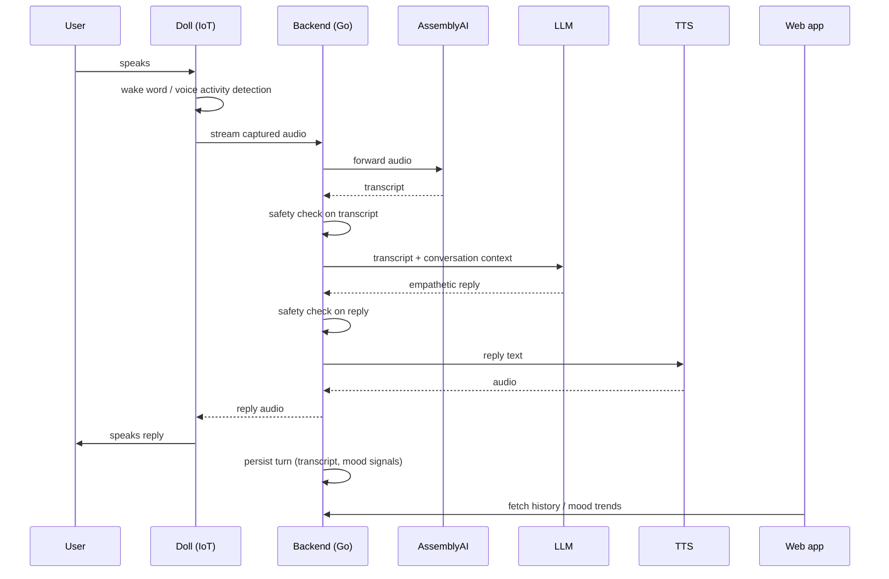

# Architecture

How Soba's parts fit together, what each one owns, and what is still undecided.

## The conversation loop

Everything Soba does revolves around one loop: the user says something to the doll, and the
doll says something back.

The two safety checks in that sequence are not optional. See
[`safety-and-privacy.md`](safety-and-privacy.md).

## Components

### `iot/` — the doll

Captures audio, decides when the user is actually talking to it, streams that audio to the
backend, and plays the reply. Also owns whatever physical feedback the doll gives — light,
haptics, movement.

Deliberately thin: the doll should not hold conversation state or make judgement calls
about what the user said. That lives in the backend, where it can be fixed without
reflashing anything.

Hardware is **not chosen yet** — see [`hardware.md`](hardware.md).

### `backend/` — the brain

A Go service that owns:

- the speech pipeline (audio in, transcript out, reply audio back)
- conversation state and context assembly for the LLM
- safety checks on both what the user said and what Soba is about to say
- persistence — conversation turns, mood signals, device registration
- the REST API the web app reads from

### `frontend/` — the web app

Where the user sees their own history: what they talked about, how their mood has moved
over time, and control over the doll and their data — including deleting it.

### AssemblyAI

Speech-to-text. Called from the backend, never directly from the doll (the API key must not
live on a device that can be opened with scissors). Details in
[`speech-pipeline.md`](speech-pipeline.md).

## Boundaries worth keeping

- **The doll never holds an API key for a third-party service.** It authenticates to our
  backend and nothing else.
- **The doll is replaceable.** A phone app or a browser tab should be able to stand in as an
  audio source for development, so nobody is blocked on hardware.
- **The frontend never talks to AssemblyAI or the LLM directly.** One backend, one place
  where safety checks and data retention are enforced.

## Open questions

These need answers before the corresponding implementation work starts. Nobody should
guess quietly — write the decision down here when it is made.

| # | Question | Blocks |
| - | -------- | ------ |
| 1 | Device ↔ backend transport: WebSocket streaming, chunked HTTP, or MQTT + object storage? | firmware, backend |
| 2 | Streaming transcription (low latency, harder) or batch per utterance (simpler, slower)? | speech pipeline |
| 3 | Where does TTS run — cloud provider, or synthesised on-device? | firmware, backend |
| 4 | How does a doll authenticate? Per-device keys provisioned at flash time, or a pairing flow through the web app? | firmware, backend, frontend |
| 5 | Which LLM provider, and does conversation context leave our infrastructure? | backend, privacy review |
| 6 | Do transcripts persist by default, or is the default ephemeral with opt-in history? | backend, frontend, privacy review |
| 7 | Multi-user: is one doll bound to one person, or shared in a household? | data model, everything |

Questions 5 and 6 are as much privacy decisions as technical ones — take them to
[`safety-and-privacy.md`](safety-and-privacy.md) before settling them.
