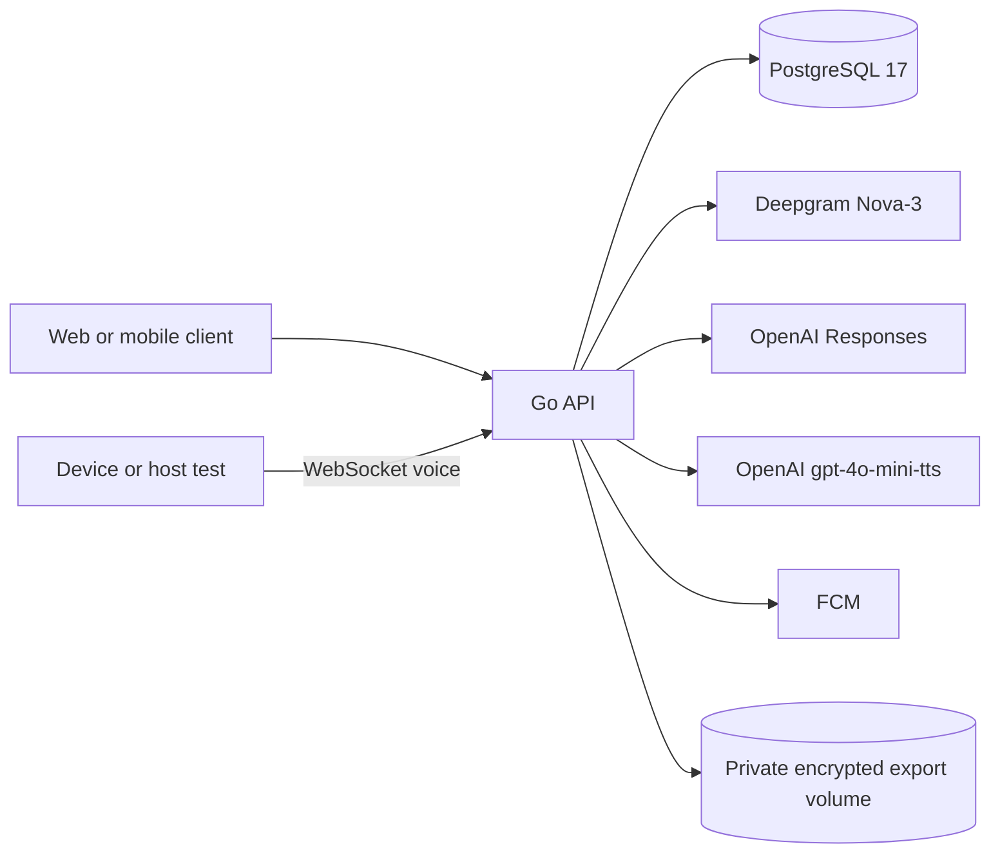

# Architecture

Soba uses one Go backend and PostgreSQL. The backend is the only component that
talks to identity, speech, language, and push providers. The client and device
send requests to the backend and never receive provider credentials.

## Runtime shape

`backend/internal/app` is the composition root. It opens the configured
providers, validates the reviewed fallback content, and registers all 87 API
operations. Startup holds a PostgreSQL advisory lock derived from the current
database and schema. A second instance fails before it can serve traffic.

The API process has one background loop for data jobs and one for support
notification jobs. A bounded PostgreSQL pool handles requests. The first pilot
uses one API replica, at most 10 active voice sessions, 20 database
connections, five idle connections, and a five-second API statement timeout.
These are operating limits and starting measurements, not a capacity claim.

## Request and voice flow

1. `httpapi.Server` validates the generated OpenAPI request, origin, rate
   limit, authentication, and CSRF rules.
2. Authenticated writes run in a transaction. The owner ID comes from the
   verified session or device credential, never from a request body.
3. Voice tickets are short-lived and single-use. `VoiceEngine` accepts raw
   16 kHz mono PCM, sends it to Deepgram, runs safety assessment before reply
   generation, checks the complete reply, and only then streams approved 24 kHz
   mono PCM from TTS.
4. A conversation ends with a transient draft. The user can save journal,
   mood, and memory candidates independently. A no-save session leaves no
   durable transcript or draft content.
5. Serious or uncertain safety results use reviewed fallback content. They do
   not ask a general model to invent crisis wording.

On startup, active sessions become `interrupted` and review sessions become
`expired`; unsaved draft metadata cannot be recovered. On close, active voice
peers receive a restart signal and all transient tickets, drafts, and safety
events are discarded.

## Data boundaries

- PostgreSQL stores owner records, consent, device credentials as hashes,
  short-lived encrypted replay values, and content-free operational metadata.
- Raw audio, prompts, generated replies, and transcript text are not stored by
  the migration schema.
- Export objects are encrypted before they enter the private filesystem volume.
  The volume is a pilot adapter for a private object bucket and has no public
  HTTP path.
- Account and history deletion cancel active work, remove saved content, revoke
  device/session authority as required, and retain only a short-lived deletion
  ledger. A provider-deletion requirement can keep a job in
  `waiting_provider` until an operator completes the external deletion review.

## Configuration and disabled paths

`platform.LoadConfig` rejects invalid base64 key sizes, unsafe production URLs,
unknown boolean flags, and unapproved minor enrollment. Voice requires
Deepgram, OpenAI, and a current reviewed content pack. Alerts require FCM
project configuration and application credentials. Both paths are disabled by
default.

The local Compose file uses PostgreSQL 17 and private named volumes. See
[Runtime operations](implementation/Runtime-Operations.md) for startup,
backup, deletion, key rotation, and incident procedures.

## Device and client boundaries

The device uses a cloud operational credential after an offline factory
enrollment and owner claim. It does not hold third-party keys. The client can
drive the same voice contract for development, so hardware is not a dependency
for backend work. See [Hardware](hardware.md) for the open electronics choice.
