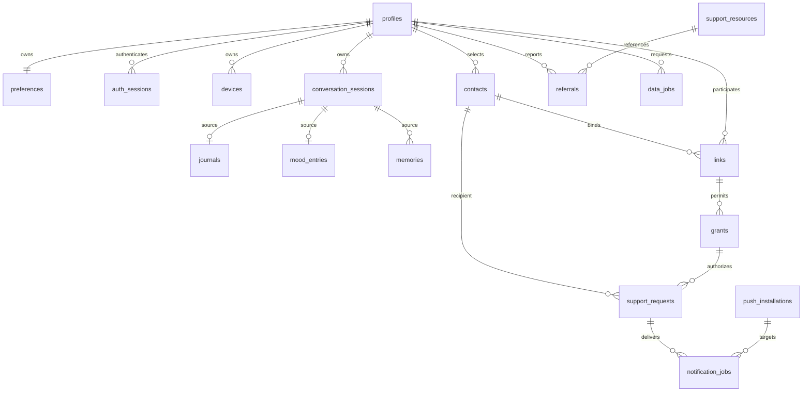

# Database reference and query rules

[001_initial.sql](database/001_initial.sql) is the authoritative DDL. It creates 27 tables plus version triggers. PostgreSQL UUIDs are supplied by the application; no extension is required. [002_invariant_tests.sql](database/002_invariant_tests.sql) contains rollback-only fixtures and constraint checks for an isolated database.

## Relationship map



The diagram summarizes domain relationships. DDL includes optional references, auth/claim/invite state, reviewed content, safety plans/events, audit, idempotency, and deletion-ledger tables. It is not an alternative schema.

## Storage-to-API mapping

| API model | Storage and computed fields |
| --- | --- |
| Profile | profiles; roles/eligibility computed and validated by policy; shared_phone is explicitly user supplied |
| Preferences | preferences; owner_id comes from authentication and is not returned |
| Device | devices; API online/offline derives from state=paired and last_seen; battery time remains reported metadata |
| Claim | device_claims; status derives from consumed_at/expiry; challenge decrypted only for the owner while pending |
| Session | conversation_sessions; API list includes live review items only |
| Draft | Process memory; not a database view or JSON column |
| Journal | journals; session_id becomes null when metadata is pruned |
| MoodEntry | mood_entries; source is set by service, not caller for conversation saves |
| Memory | memories; raw source session/candidate identifiers are not exposed in the public model |
| Contact | contacts plus latest live invite/link; linked_user_id from active link recipient; status follows the explicit precedence rule below |
| Link | links; subject_id maps owner_id; display names join the subject and recipient profiles |
| Grant | grants; link must still be active for grant to be effective |
| Pulse/Trends | Aggregates over current approved mood_entries, with Backend-Spec privacy limits |
| ContentItem | content_items; only approved/unexpired versions visible |
| SafetyPlan | safety_plans; row initialized on account creation |
| SupportResource | support_resources; only reviewed/unexpired items visible |
| Referral | referrals joined to resource; reported_by is constant user |
| SupportRequest | support_requests; recipient and grant selected from owned active contact/link |
| Alert | support_requests joined to link and subject; no mood/reason/assessment/transcript returned |
| ReachOut | current subject shared_phone after request/grant check; fixed template from reviewed content pack |
| DataJob | data_jobs; download_path computed only for ready owner export; receipt returned only on account-deletion creation |

A revoked Contact status means a retained revoked link exists and no active/new pending invitation exists. A new pending invitation takes precedence over an old revoked link. Implement this explicit order: active link → pending invite/accepted link → latest revoked link → unlinked. Do not infer active status from a non-null recipient ID alone.

## Permission query example

Every guardian query starts from a current active link and non-revoked grant. Use parameterized SQL. Do not load private rows and filter in application memory.

```sql
SELECT p.id, p.display_name
FROM profiles p
JOIN links l ON l.owner_id = p.id
JOIN grants g ON g.link_id = l.id AND g.owner_id = p.id
WHERE p.id = $1 AND l.recipient_id = $2
  AND l.kind = 'guardian' AND l.state = 'active'
  AND g.scope = $3 AND g.revoked_at IS NULL
  AND p.deleting = false;
```

`$1` is the requested subject, `$2` is authenticated recipient, and `$3` is the fixed scope for that endpoint, never an unchecked caller string. Check for an active history-deletion job as well before returning history-derived values. A no-row result is access denied without extra detail.

## Job-claim query example

```sql
WITH ready AS (
  SELECT id FROM notification_jobs
  WHERE (state = 'queued' AND next_attempt_at <= now())
     OR (state = 'leased' AND lease_expires_at <= now())
  ORDER BY next_attempt_at, id
  FOR UPDATE SKIP LOCKED
  LIMIT 10
)
UPDATE notification_jobs j
SET state = 'leased', lease_token = $1,
    lease_expires_at = now() + interval '30 seconds'
FROM ready WHERE j.id = ready.id
RETURNING j.*;
```

Commit before calling FCM. Before dispatch check parent request expiry/current grant and installation. Update an attempt only with `WHERE id=$id AND lease_token=$token AND state='leased'`. A shared batch lease token is acceptable because each update is also bound to its job ID.

## Constraints and checks

The schema enforces one active session per owner/device, one live contact link, one live scope per link, valid enum/state bounds, and owner-consistent session children. Support request link/contact and grant/link combinations are constrained together. Confirmation time is mandatory for queued/accepted/acknowledged/failed requests.

Application validation additionally enforces per-array-item text lengths, actual IANA timezone names, resource URL allowlist, current policy, eligibility, supported locale/provider mapping, state transitions, and relationship-specific scopes. SQL checks cannot prove external consent, provider delivery, or clinical quality.

Version triggers update updated_at and increment version. Clients must not write timestamps or increment versions themselves. Use the returned row as the response. PostgreSQL transaction time is used for stored creation timestamps; clock_timestamp is used for updates. Store occurrence time independently for user check-ins.

## Deletion and pruning order

History deletion: block writes/increment generation → cancel active session and dispatch → delete notification_jobs/support_requests → delete safety_events → delete journals/moods/memories → delete conversation_sessions → delete export objects and content-bearing idempotency responses for this actor → complete job. Preserve contacts/links/preferences/devices for history-only deletion.

Account deletion additionally revokes/unpairs devices, removes invites/grants/links/contacts/plans/referrals/installations/auth state, then removes the profile. Preserve the pseudonymous deletion ledger and minimal receipt status until their defined expiry. The cleanup worker must not depend on a profile foreign key that has already been removed.

Session pruning without history deletion first nulls child session references in saved entries and safety events, then removes old metadata. This avoids either blocking cleanup or cascading away approved user content.
